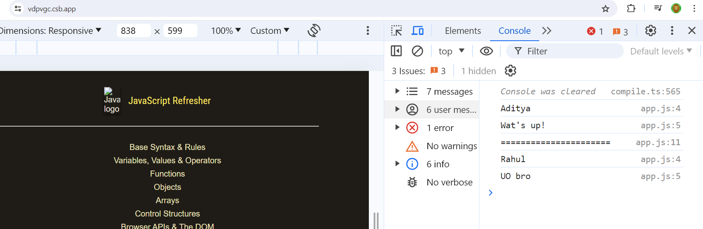
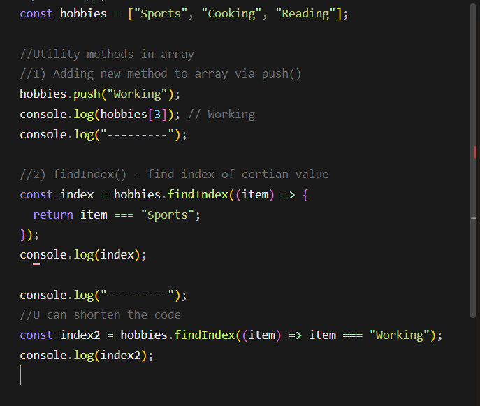
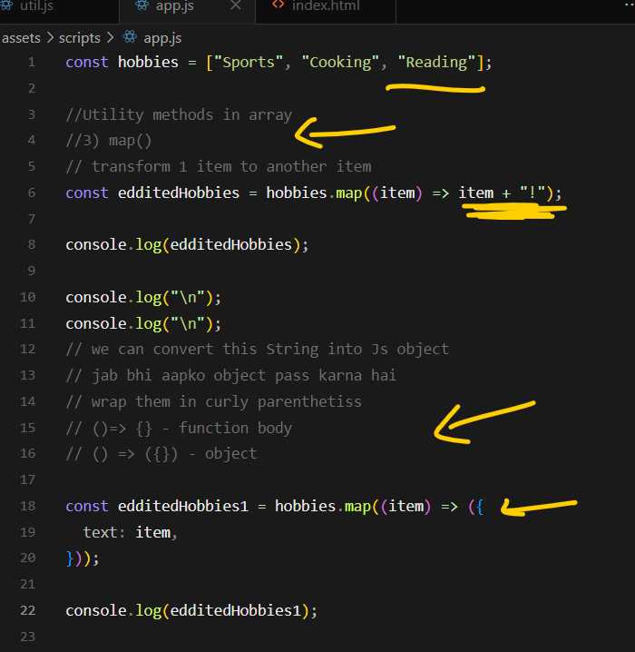
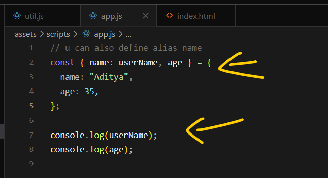

# Section-2
# 16 import & export
## 1)

](image.png)
## 3)

## 4)

## 5)

# 17 Variable and value
## 1)

## 2)

# 18 Operator

# 19. Function & Parameter
## 1)

## 2)

## 3)

## 4)

# 20. Arrow function

# 21. More about Arrow function

# 22. Revisiting object and classes

## 1)

## 2)

## 3)

## 4)

# 23. Arrays and Array methods like map()
## 1)

## 2)

## 3)

# 24. Destructring
## 1)

## 2)

## 3)

# 25. Destructuring in Function parameters list

# 26. Spread Operator
